<!--
*** Thanks for checking out c. If you have a suggestion
*** that would make this better, please fork the repo and create a pull request
*** or simply open an issue with the tag "enhancement".
*** Thanks again! Now go create something AMAZING! :D
-->

<!-- PROJECT SHIELDS -->
<!--
*** I'm using markdown "reference style" links for readability.
*** Reference links are enclosed in brackets [ ] instead of parentheses ( ).
*** See the bottom of this document for the declaration of the reference variables
*** for contributors-url, forks-url, etc. This is an optional, concise syntax you may use.
*** https://www.markdownguide.org/basic-syntax/#reference-style-links
-->

[![Contributors][contributors-shield]][contributors-url]
[![Forks][forks-shield]][forks-url]
[![Stargazers][stars-shield]][stars-url]
[![Issues][issues-shield]][issues-url]
[![LinkedIn][linkedin-shield]][linkedin-url]
[![NO LICENSE][license-shield]][license-url]

<!-- PROJECT LOGO -->
 

  <a href="https://gdansk.pja.edu.pl/pl/">
    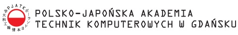
  </a>

  <h2 align="center">WEB technologies</h2>

  

    <h3> Different solutions for World Wide Web </h3>
    <!--  
    <a href="https://github.com/dccstcc/TIN_PJATK_practice"><strong>» go to CODE »</strong></a>
     
      -->
    <!-- <a href="https://github.com/othneildrew/Best-README-Template">View Demo</a>
    ·
    <a href="https://github.com/othneildrew/Best-README-Template/issues">Report Bug</a>
    ·
    <a href="https://github.com/othneildrew/Best-README-Template/issues">Request Feature</a> -->
  

<!-- TABLE OF CONTENTS -->

  
Table of Contents

  <ol>
    <li>
      <a href="#project-description">Project description</a>
      <ul>
        <li><a href="#libraries-and-frameworks">Libraries / Frameworks</a></li>
      </ul>
    </li>
    <li>
      <a href="#native-deploy">Native deploy</a>
      <ul>
        <li><a href="#prerequisites">Prerequisites</a></li>
        <li><a href="#list-of-projects">List of projects</a></li>
      </ul>
    </li>
    <li><a href="#how-to-use">How to use ?</a></li>
    <!-- <li><a href="#roadmap">Roadmap</a></li>
    <li><a href="#contributing">Contributing</a></li> -->
    <li><a href="#license">License</a></li>
    <li><a href="#contact">Contact with me</a></li>
    <!-- <li><a href="#acknowledgements">Acknowledgements</a></li> -->
  </ol>

<!-- ABOUT THE PROJECT -->

## Project description

 In this project I try implement different types of technics use in web technologies. 

### Libraries and frameworks

This project use technology below.

- [![javascript][javascript-shield]][javascript-url]
- [![css][css-shield]][css-url]
- [![html][html-shield]][html-url]
- [![node][node-shield]][node-url]

<!-- GETTING STARTED -->

## Native deploy

Bottom links contains web projects for run into browser.

### Prerequisites

Node.js for build web page is required.  

### List of projects

 

1. [Web page initialization](https://github.com/dccstcc/TIN_PJATK_practice/tree/main/lab1)
    

 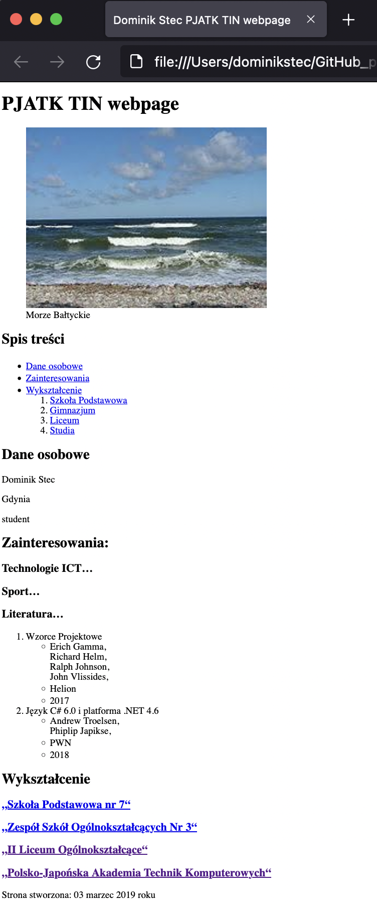
 
   
   

2. [Web page evolution](https://github.com/dccstcc/TIN_PJATK_practice/tree/main/lab2)
    

 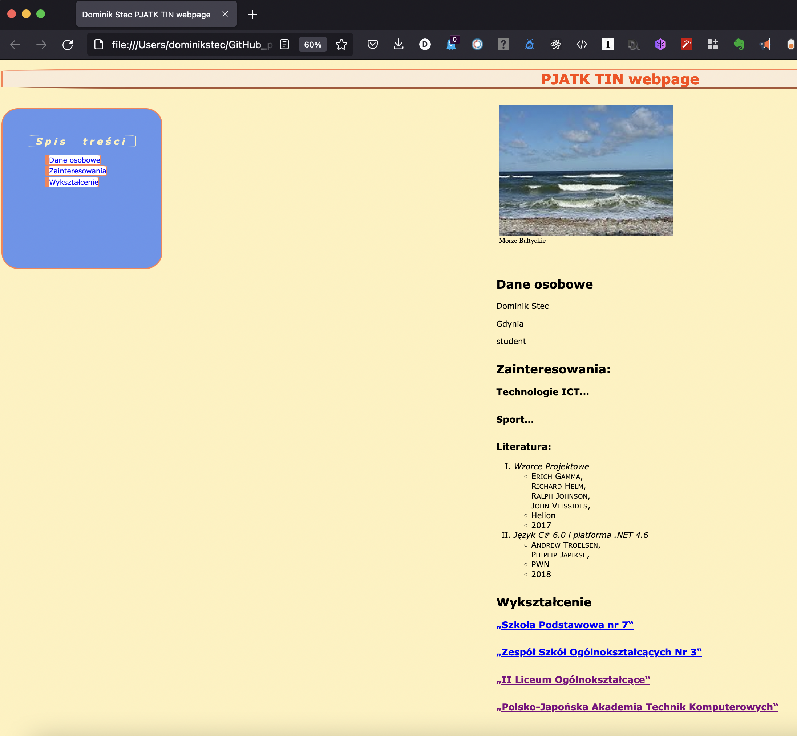
 
   
   

3. [Different web technics](https://github.com/dccstcc/TIN_PJATK_practice/tree/main/lab3)
    

 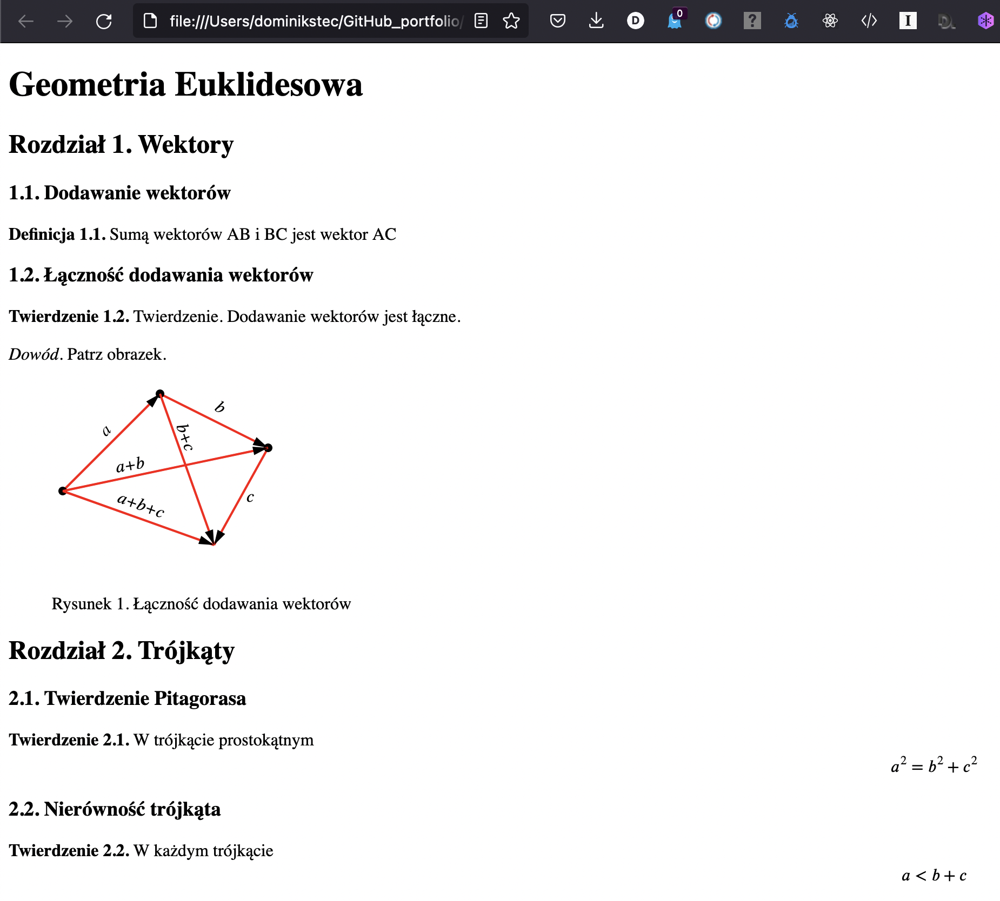

 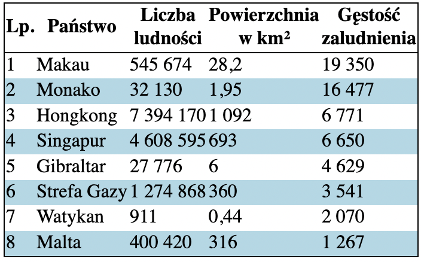

 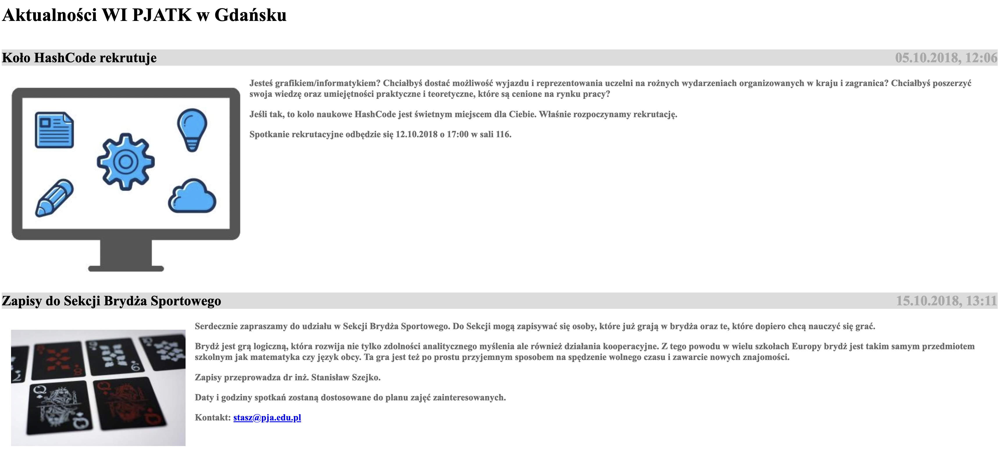
 
   
   

4. [Standalone web page](https://github.com/dccstcc/TIN_PJATK_practice/tree/main/lab4)
    

 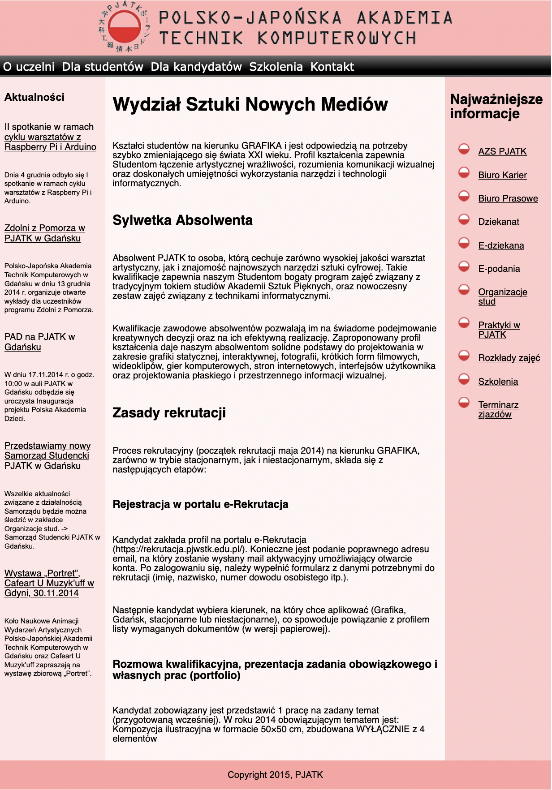
 
   
   

5. [JavaScript scripts](https://github.com/dccstcc/TIN_PJATK_practice/tree/main/lab5)
    

 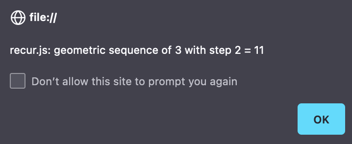
 
 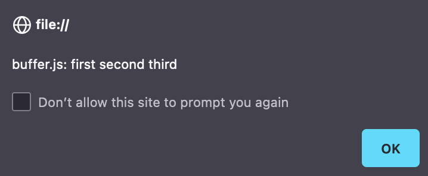

 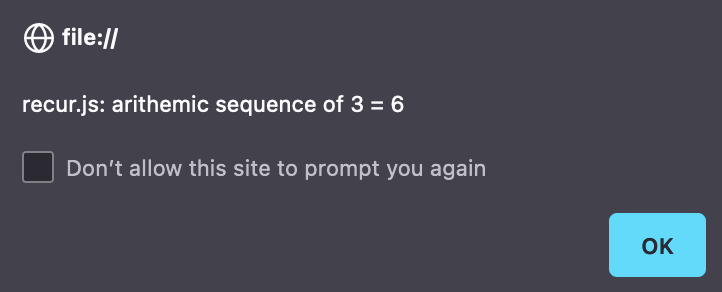

 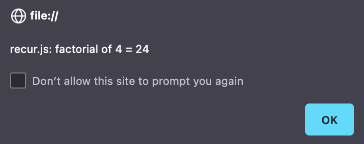

 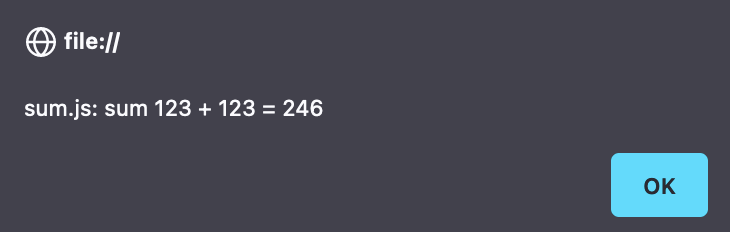
 
   
   

6. [Node.js simple project](https://github.com/dccstcc/TIN_PJATK_practice/tree/main/lab6)
    

 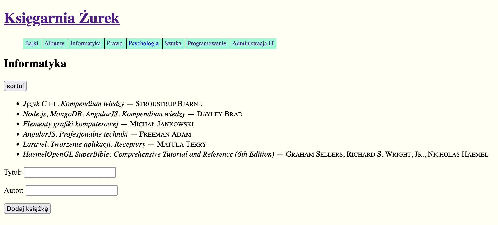
 
   
   

<!-- USAGE EXAMPLES -->

## How to use

Under specified links are index.html files. This files are entry to run projects into web browser.  
`Node.js simple project` need Node.js library.
 
In this project run `npm start`

<!-- _For more examples, please refer to the [Documentation](https://example.com)_ -->

<!-- ROADMAP
## Roadmap

See the [open issues](https://github.com/othneildrew/Best-README-Template/issues) for a list of proposed features (and known issues).

-->

<!-- CONTRIBUTING
## Contributing

Contributions are what make the open source community such an amazing place to learn, inspire, and create. Any contributions you make are **greatly appreciated**.

1. Fork the Project
2. Create your Feature Branch (`git checkout -b feature/AmazingFeature`)
3. Commit your Changes (`git commit -m 'Add some AmazingFeature'`)
4. Push to the Branch (`git push origin feature/AmazingFeature`)
5. Open a Pull Request

-->

<!-- LICENSE -->

## License

This project has not a license.
All rights are reserved and it is not Open Source or free. You cannot modify or redistribute this code without explicit permission from the copyright holder, because projects which I realised are private conception from PJATK studies.
See `LICENSE` for more information.

<!-- CONTACT -->

## Contact

Dominik Stec - dominikstec@devapp.tools

[![LinkedIn][linkedin-shield]][linkedin-url]

Project URL:
 
`https://github.com/dominik-stec/WEB_technologies_PJA.git`

<!-- ACKNOWLEDGEMENTS
## Acknowledgements
* [GitHub Emoji Cheat Sheet](https://www.webpagefx.com/tools/emoji-cheat-sheet)
* [Img Shields](https://shields.io)
* [Choose an Open Source License](https://choosealicense.com)
* [GitHub Pages](https://pages.github.com)
* [Animate.css](https://daneden.github.io/animate.css)
* [Loaders.css](https://connoratherton.com/loaders)
* [Slick Carousel](https://kenwheeler.github.io/slick)
* [Smooth Scroll](https://github.com/cferdinandi/smooth-scroll)
* [Sticky Kit](http://leafo.net/sticky-kit)
* [JVectorMap](http://jvectormap.com)
* [Font Awesome](https://fontawesome.com)

-->

<!-- MARKDOWN LINKS & IMAGES -->
<!-- https://www.markdownguide.org/basic-syntax/#reference-style-links -->

[contributors-shield]: https://img.shields.io/github/contributors/dominik-stec/WEB_technologies_PJA.svg?style=for-the-badge
[contributors-url]: https://github.com/dominik-stec/WEB_technologies_PJA/graphs/contributors
[forks-shield]: https://img.shields.io/github/forks/dominik-stec/WEB_technologies_PJA.svg?style=for-the-badge
[forks-url]: https://github.com/dominik-stec/WEB_technologies_PJA/network/members
[stars-shield]: https://img.shields.io/github/stars/dominik-stec/WEB_technologies_PJA.svg?style=for-the-badge
[stars-url]: https://github.com/dominik-stec/WEB_technologies_PJA/stargazers
[issues-shield]: https://img.shields.io/github/issues/dominik-stec/WEB_technologies_PJA.svg?style=for-the-badge
[issues-url]: https://github.com/dominik-stec/WEB_technologies_PJA/issues
[license-shield]: https://img.shields.io/badge/License-NONE-orange
[license-url]: https://github.com/dominik-stec/WEB_technologies_PJA/blob/master/LICENSE.md
[linkedin-shield]: https://img.shields.io/badge/-LinkedIn-black.svg?style=for-the-badge&logo=linkedin&colorB=555
[linkedin-url]: https://www.linkedin.com/in/dominik-stec
[product-screenshot]: images/screenshot.png
[junit-shield]: https://img.shields.io/badge/-JUnit-green
[junit-url]: https://junit.org/junit5/
[mockito-shield]: https://img.shields.io/badge/-Mockito-red
[mockito-url]: https://site.mockito.org/
[docker-shield]: https://img.shields.io/badge/-Docker-blue
[docker-url]: https://www.docker.com/
[maven-shield]: https://img.shields.io/badge/-Maven-white
[maven-url]: https://maven.apache.org/
[cucumber-shield]: https://img.shields.io/badge/-Cucumber-green
[cucumber-url]: https://cucumber.io/
[jetty-shield]: https://img.shields.io/badge/-Jetty-red
[jetty-url]: https://www.eclipse.org/jetty/
[jmeter-shield]: https://img.shields.io/badge/-Jmeter-blue
[jmeter-url]: https://jmeter.apache.org/
[selenium-shield]: https://img.shields.io/badge/-Selenium-yellow
[selenium-url]: https://www.selenium.dev/
[robotframework-shield]: https://img.shields.io/badge/-Robot-black
[robotframework-url]: https://robotframework.org/
[python-shield]: https://img.shields.io/badge/-Python-yellow
[python-url]: https://www.python.org/
[node-shield]: https://img.shields.io/badge/-Node-green
[node-url]: https://nodejs.org/en/
[javascript-shield]: https://img.shields.io/badge/-JavaScript-red
[javascript-url]: https://developer.mozilla.org/pl/docs/Web/JavaScript
[html-shield]: https://img.shields.io/badge/-HTML-white
[html-url]: https://www.w3schools.com/html/
[css-shield]: https://img.shields.io/badge/-CSS-yellow
[css-url]: https://www.w3schools.com/css/
